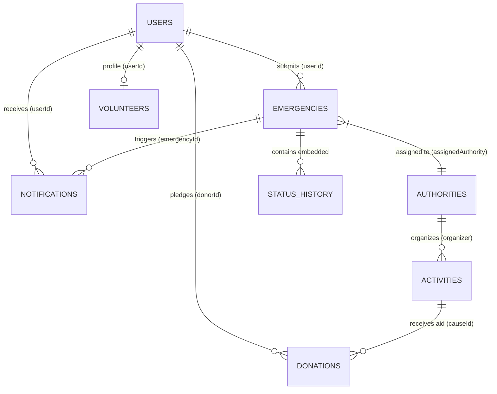

# CrisisConnect - Database Architecture & Seeding Workspace

**System Overview:** CrisisConnect is an AI-powered emergency response and social service platform built on Firebase Firestore.

This repository contains the Firestore data schemas, seed scripts, client integration helpers, security rules, and recommended indexes.

---

## Workspace Structure

- `seed.js` — Node.js script using Firebase Admin SDK to seed all 7 collections into Firestore.
- `clientSaveExample.js` — Client-side JavaScript / Web SDK (v10+) code snippets for creating and updating documents.
- `firestore.rules` — Security rules protecting users, emergencies, authorities, and notifications.
- `firestore.indexes.json` — Composite indexes optimized for real-time query performance.

---

## Entity Relationship Diagram



---

## How to Seed to Firestore

1. Download your service account key from **Firebase Console** -> **Project Settings** -> **Service Accounts**.
2. Save it as `serviceAccountKey.json` inside this directory.
3. Run:
   ```bash
   npm install
   node seed.js
   ```

---

## Quick Git Commands

To push this repository to Harsh's Git collaboration repository:

```bash
git init
git add .
git commit -m "feat: Add CrisisConnect Firestore database setup, schemas, and seed scripts"
git branch -M main
git remote add origin <PASTE_HARSH_REPOSITORY_URL_HERE>
git push -u origin main
```
